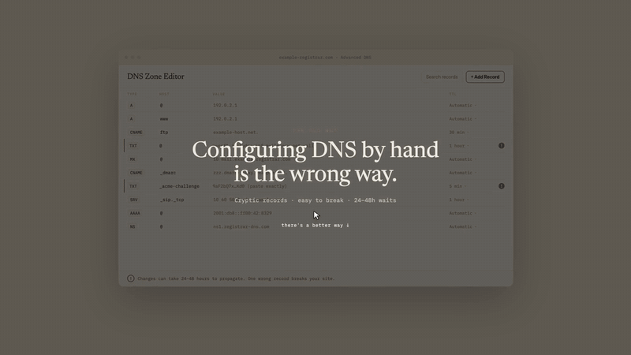
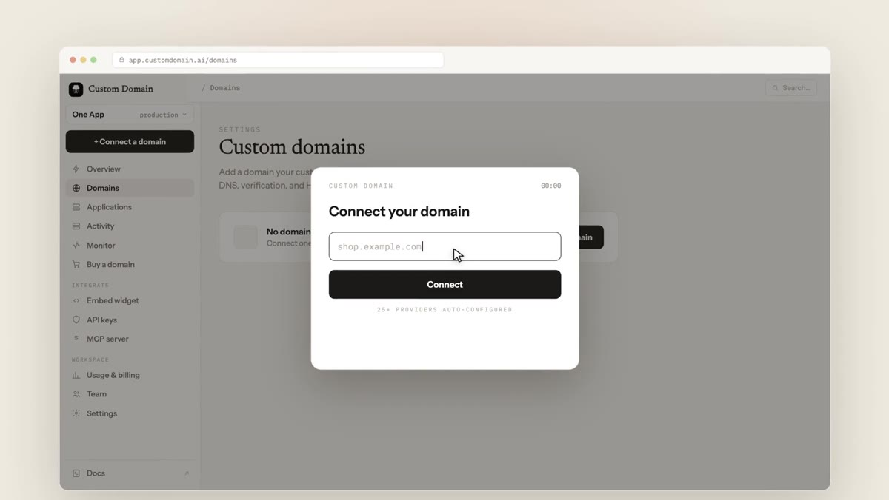
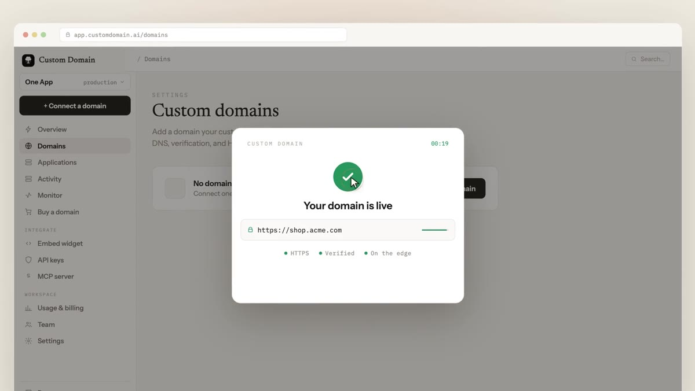

<h1 align="center">Custom Domain</h1>

<p align="center"><strong>One-click custom domains for SaaS. Automatic DNS, domain verification, and SSL/TLS on your users' own domains.</strong></p>

<p align="center">
  <a href="https://customdomain.ai">Website</a> ·
  <a href="https://app.customdomain.ai/docs">Docs</a> ·
  <a href="https://customdomain.ai/custom-domain-api">REST API</a> ·
  <a href="https://customdomain.ai/mcp-server">MCP Server</a> ·
  <a href="https://customdomain.ai/connect-domain-widget">Widget</a> ·
  <a href="https://app.customdomain.ai/signup"><strong>Get started free</strong></a>
</p>

<p align="center">
  <a href="https://app.customdomain.ai/docs"></a>
  <a href="https://customdomain.ai/mcp-server"></a>
  <a href="https://trust.customdomain.ai"></a>
  <a href="https://customdomain.ai/pricing"></a>
</p>

---

**Custom Domain** lets a platform's users connect a domain they already own in one click. It detects the user's DNS provider, writes the records automatically, verifies domain ownership (CNAME/TXT), and issues and renews TLS certificates at a managed edge. **63 DNS and registrar providers** are supported through one-click provider authorization, API tokens, or a guided manual flow with automatic verification; **25+ providers configure fully automatically**, and a domain connected through provider authorization is typically **live with HTTPS in about 30 seconds**.

## See it work

The connect flow, run on a real domain: provider detected, records written, ownership verified, certificate issued.



<table>
<tr>
<td width="50%" align="center">

**Your user types their domain**



</td>
<td width="50%" align="center">

**Live with HTTPS, seconds later**



</td>
</tr>
</table>

## Who this is for

<table>
<tr>
<td align="center" width="25%">

**🧱 Website builders**

Your users publish sites and want their own domain on them.

[connect-domain-for-website-builders](https://github.com/CUSTOM-DOMAIN-APP/connect-domain-for-website-builders)

</td>
<td align="center" width="25%">

**✉️ Email platforms**

Sending domains with SPF, DKIM, and DMARC written automatically.

[connect-domain-for-email-platforms](https://github.com/CUSTOM-DOMAIN-APP/connect-domain-for-email-platforms)

</td>
<td align="center" width="25%">

**🤖 AI agents**

Agents that provision apps need real domains: search, buy, connect, over MCP or API.

[connect-domain-for-ai-agents](https://github.com/CUSTOM-DOMAIN-APP/connect-domain-for-ai-agents)

</td>
<td align="center" width="25%">

**🏢 Agencies**

Client domains under your brand, without collecting registrar logins.

[connect-domain-for-agencies](https://github.com/CUSTOM-DOMAIN-APP/connect-domain-for-agencies)

</td>
</tr>
</table>

Also: **e-commerce platforms** (a storefront per merchant domain), **creator tools** (a domain per creator), and any **multi-tenant SaaS** where tenants deserve their own name in the address bar. Start at [custom domains for SaaS](https://customdomain.ai/custom-domains-for-saas).

## 63 supported DNS and registrar providers

One connect flow across the entire provider landscape: one-click authorization where providers support it, API tokens where they offer them, and a guided manual path with automatic verification everywhere else. No user ever hits a dead end.

<a href="https://customdomain.ai/one-click-dns-setup"></a>

| Connection method | Providers | User effort | Typical time to live |
|---|---|---|---|
| One-click provider authorization | 25+ auto-configured | One click, no credentials shared | ~30 seconds |
| API token | Included in the 63 | Paste one scoped token | Minutes |
| Guided manual + automatic verification | Everything else | Copy 2 to 4 records | Minutes, cache-dependent |

## For developers and AI agents

> [!TIP]
> **Coding agents:** point your MCP client at the hosted server and your agent can search, register, and connect domains end to end, with DNS, verification, and TLS handled.

```bash
claude mcp add --transport http customdomain https://mcp.customdomain.ai/mcp
```

```json
{
  "mcpServers": {
    "customdomain": {
      "type": "http",
      "url": "https://mcp.customdomain.ai/mcp"
    }
  }
}
```

<details>
<summary><strong>Connect a domain via the REST API</strong></summary>

<br>

```bash
# 1. Create a connection for your user's domain
curl -X POST https://app.customdomain.ai/v1/connections \
  -H "Authorization: Bearer $API_KEY" \
  -d '{"domain": "app.customer.com", "application_id": "<app>"}'

# 2. Start one-click provider authorization (fallbacks: token or guided manual)
curl -X POST https://app.customdomain.ai/v1/connections/<ID>/oauth:start \
  -H "Authorization: Bearer $API_KEY"

# 3. Poll until live: records written, ownership verified, TLS issued
curl https://app.customdomain.ai/v1/connections/<ID> \
  -H "Authorization: Bearer $API_KEY"
```

Shapes are illustrative; exact schemas live in the [API reference](https://app.customdomain.ai/docs/api-reference). The API also covers DNS records, TLS lifecycle, monitoring, webhooks, and registrar search and purchase. Agent index: [llms.txt](https://app.customdomain.ai/docs/llms.txt).

</details>

## Repositories

| Repository | What you'll find |
|---|---|
| [docs](https://github.com/CUSTOM-DOMAIN-APP/docs) | The product documentation source of truth, rendered at [app.customdomain.ai/docs](https://app.customdomain.ai/docs). Questions welcome in [Discussions](https://github.com/CUSTOM-DOMAIN-APP/docs/discussions). |
| [connect-domain-for-website-builders](https://github.com/CUSTOM-DOMAIN-APP/connect-domain-for-website-builders) | The complete guide to offering custom domains on a site builder: records, verification, TLS at tenant scale, connect-flow UX. |
| [connect-domain-for-email-platforms](https://github.com/CUSTOM-DOMAIN-APP/connect-domain-for-email-platforms) | Sending-domain onboarding: SPF, DKIM, DMARC, return-path, deliverability, and automating all of it. |
| [connect-domain-for-ai-agents](https://github.com/CUSTOM-DOMAIN-APP/connect-domain-for-ai-agents) | Agents that ship websites need domains: the MCP server, the API flow, and agent-safe DNS security. |
| [connect-domain-for-agencies](https://github.com/CUSTOM-DOMAIN-APP/connect-domain-for-agencies) | Managing client domains at fleet scale: ownership, white-label connection, drift monitoring, bulk operations. |
| [awesome-custom-domains](https://github.com/CUSTOM-DOMAIN-APP/awesome-custom-domains) | The curated map of the whole space: managed services, DIY building blocks, protocols, and examples. |
| [customdomain-mcp](https://github.com/ever-just/customdomain-mcp) | The hosted MCP server: config for Claude, Cursor, and ChatGPT. |
| [custom-domain-checks](https://github.com/CUSTOM-DOMAIN-APP/custom-domain-checks) | Our GitHub App: continuous DNS and TLS health checks for custom domains on GitHub Pages. |
| custom-domains | The product itself: control plane, TLS-terminating edge, dashboard. Private. |

## Common questions

**How do I let my users connect their own domain?**
Embed the [connect widget](https://customdomain.ai/connect-domain-widget) or call the [REST API](https://customdomain.ai/custom-domain-api). Custom Domain handles provider detection, DNS, ownership verification, certificates, and serving.

**What is bring your own domain (BYOD)?**
Letting each customer run your product on a domain they own, like `app.acme.com`, instead of a shared subdomain. [Full definition](https://customdomain.ai/glossary/bring-your-own-domain), and [custom domain vs subdomain](https://customdomain.ai/glossary/custom-domain-vs-subdomain) if you're weighing the tradeoffs.

**How fast can a customer domain go live?**
With one-click provider authorization, about 30 seconds from typing the domain to serving HTTPS. Guided manual setups depend on the customer applying records; verification is detected automatically once they do.

**Does this work for email domains?**
Yes. SPF, DKIM, DMARC, MX, and return-path records are written through the same connect flow. See [connect-domain-for-email-platforms](https://github.com/CUSTOM-DOMAIN-APP/connect-domain-for-email-platforms).

**Is there a free tier?**
Yes, [pricing starts at $0](https://customdomain.ai/pricing) with the full product: widget, API, automatic TLS, monitoring, and the MCP server.

---

## Run a domain on GitHub Pages? Add our GitHub App

**[Custom Domain Checks](https://github.com/apps/custom-domain-checks)** watches the custom domain on your GitHub Pages repositories and posts a **Domain health** check on every push: DNS resolution, CNAME or apex target correctness, domain verification (takeover protection), CAA compatibility, certificate expiry, and HTTPS enforcement. It opens a tracking issue the moment something breaks. Free, [open on GitHub](https://github.com/CUSTOM-DOMAIN-APP/custom-domain-checks).

---

<p align="center">
  <a href="https://app.customdomain.ai/signup"><strong>Connect your first domain free →</strong></a>
</p>

<p align="center">
  <sub>Security posture, compliance frameworks, and sub-processors: <a href="https://trust.customdomain.ai">trust.customdomain.ai</a> · Questions: <a href="https://github.com/CUSTOM-DOMAIN-APP/docs/discussions">Discussions</a> · <a href="https://customdomain.ai/appointment">Book a call</a></sub>
</p>
