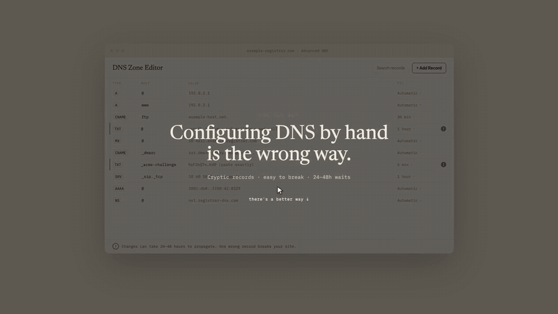
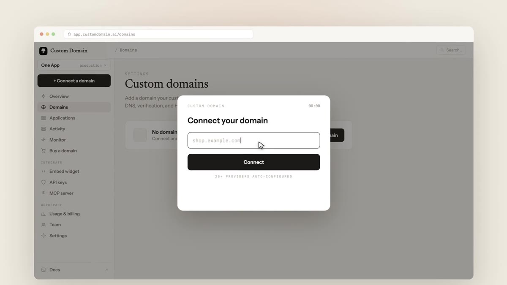
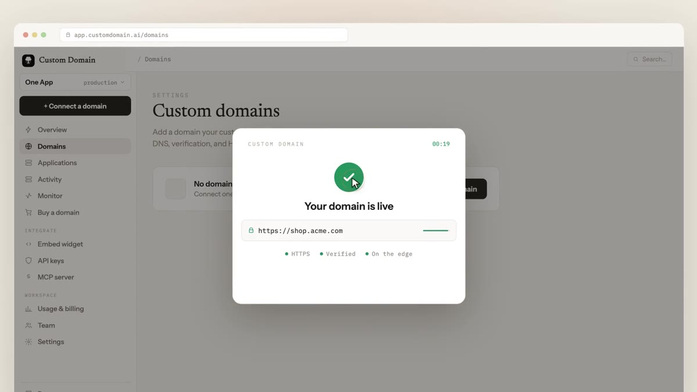

<h1 align="center">CustomDomain™</h1>

<p align="center"><strong>One-click custom domains for SaaS. Automatic DNS, domain verification, and SSL/TLS on your users' own domains.</strong></p>

<p align="center">
  <a href="https://customdomain.ai">Website</a> ·
  <a href="https://docs.customdomain.ai/docs">Docs</a> ·
  <a href="https://customdomain.ai/custom-domain-api">REST API</a> ·
  <a href="https://customdomain.ai/mcp-server">MCP Server</a> ·
  <a href="https://customdomain.ai/connect-domain-widget">Widget</a> ·
  <a href="https://app.customdomain.ai/signup"><strong>Get started free</strong></a>
</p>

<p align="center">
  <a href="https://docs.customdomain.ai/docs"></a>
  <a href="https://customdomain.ai/mcp-server"></a>
  <a href="https://trust.customdomain.ai"></a>
  <a href="https://customdomain.ai/pricing"></a>
</p>

---

**CustomDomain™** lets a platform's users connect a domain they already own in one click. It detects the user's DNS provider, writes the records automatically, verifies them against public DNS, and issues and renews TLS certificates at a managed edge. **63 DNS and registrar providers** are catalogued: **25 configure automatically** (17 by scoped API token, 6 by provider OAuth, 2 by Domain Connect), and the other 38 use a guided manual flow with automatic verification. A domain connected through provider authorization is typically **live with HTTPS in about 30 seconds**.

## See it work

The connect flow, run on a real domain: provider detected, records written and verified, certificate issued.



<table>
<tr>
<td width="50%" align="center">

**Your user types their domain**



</td>
<td width="50%" align="center">

**Live with HTTPS, seconds later**



</td>
</tr>
</table>

## Who this is for

<table>
<tr>
<td align="center" width="25%">

**🧱 Website builders**

Your users publish sites and want their own domain on them.

[connect-domain-for-website-builders](https://github.com/CUSTOM-DOMAIN-APP/connect-domain-for-website-builders)

</td>
<td align="center" width="25%">

**✉️ Email platforms**

Sending domains with SPF, DKIM, and DMARC written automatically.

[connect-domain-for-email-platforms](https://github.com/CUSTOM-DOMAIN-APP/connect-domain-for-email-platforms)

</td>
<td align="center" width="25%">

**🤖 AI agents**

Agents that provision apps need real domains: search, buy, connect, over MCP or API.

[connect-domain-for-ai-agents](https://github.com/CUSTOM-DOMAIN-APP/connect-domain-for-ai-agents)

</td>
<td align="center" width="25%">

**🏢 Agencies**

Client domains under your brand, without collecting registrar logins.

[connect-domain-for-agencies](https://github.com/CUSTOM-DOMAIN-APP/connect-domain-for-agencies)

</td>
</tr>
</table>

Also: **e-commerce platforms** (a storefront per merchant domain), **creator tools** (a domain per creator), and any **multi-tenant SaaS** where tenants deserve their own name in the address bar. Start at [custom domains for SaaS](https://customdomain.ai/custom-domains-for-saas).

## 63 supported DNS and registrar providers

One connect flow across the entire provider landscape: one-click authorization where providers support it, API tokens where they offer them, and a guided manual path with automatic verification everywhere else. No user ever hits a dead end.

<a href="https://customdomain.ai/one-click-dns-setup"></a>

| Connection method | Providers | User effort | Typical time to live |
|---|---|---|---|
| One-click provider authorization | 8 (6 provider OAuth, 2 Domain Connect) | One click, no credentials shared | About 30 seconds |
| Scoped API token | 17 | Paste one scoped token | Minutes |
| Guided manual + automatic verification | 38 | Copy the exact records shown | Minutes, cache-dependent |

## For developers and AI agents

> [!TIP]
> **Coding agents:** point your MCP client at the hosted server with an API key and your agent can search, register, and connect domains end to end, with DNS, verification, and TLS handled.

```bash
claude mcp add --transport http customdomain https://mcp.customdomain.ai/mcp \
  --header "Authorization: Bearer $CUSTOMDOMAIN_API_KEY"
```

```json
{
  "mcpServers": {
    "customdomain": {
      "type": "http",
      "url": "https://mcp.customdomain.ai/mcp",
      "headers": { "Authorization": "Bearer sk_live_YOUR_KEY" }
    }
  }
}
```

<details>
<summary><strong>Connect a domain via the REST API</strong></summary>

<br>

```bash
# 1. Create a connection for your user's domain (the application comes from the key)
curl -X POST https://api.customdomain.ai/v1/connections \
  -H "Authorization: Bearer $API_KEY" \
  -H "Content-Type: application/json" \
  -d '{"domain": "app.customer.com"}'

# 2. Start one-click provider authorization (fallbacks: token or guided manual).
#    return_origin is required and must be on your allowlist.
curl -X POST https://api.customdomain.ai/v1/connections/<ID>/oauth:start \
  -H "Authorization: Bearer $API_KEY" \
  -H "Content-Type: application/json" \
  -d '{"return_origin": "https://app.yourplatform.com"}'

# 3. Poll until live: records written, verified in public DNS, TLS issued
curl https://api.customdomain.ai/v1/connections/<ID> \
  -H "Authorization: Bearer $API_KEY"
```

Shapes are illustrative; exact schemas live in the [API reference](https://docs.customdomain.ai/docs/api-reference). The API also covers DNS records, TLS lifecycle, monitoring, webhooks, and registrar search and purchase. Agent index: [llms.txt](https://docs.customdomain.ai/docs/llms.txt).

</details>

## Repositories

| Repository | What you'll find |
|---|---|
| [docs](https://github.com/CUSTOM-DOMAIN-APP/docs) | The product documentation source of truth, rendered at [docs.customdomain.ai](https://docs.customdomain.ai/docs). Questions welcome in [Discussions](https://github.com/CUSTOM-DOMAIN-APP/docs/discussions). |
| [connect-domain-for-website-builders](https://github.com/CUSTOM-DOMAIN-APP/connect-domain-for-website-builders) | The complete guide to offering custom domains on a site builder: records, verification, TLS at tenant scale, connect-flow UX. |
| [connect-domain-for-email-platforms](https://github.com/CUSTOM-DOMAIN-APP/connect-domain-for-email-platforms) | Sending-domain onboarding: SPF, DKIM, DMARC, return-path, deliverability, and automating all of it. |
| [connect-domain-for-ai-agents](https://github.com/CUSTOM-DOMAIN-APP/connect-domain-for-ai-agents) | Agents that ship websites need domains: the MCP server, the API flow, and agent-safe DNS security. |
| [connect-domain-for-agencies](https://github.com/CUSTOM-DOMAIN-APP/connect-domain-for-agencies) | Managing client domains at fleet scale: ownership, white-label connection, drift monitoring, bulk operations. |
| [awesome-custom-domains](https://github.com/CUSTOM-DOMAIN-APP/awesome-custom-domains) | The curated map of the whole space: managed services, DIY building blocks, protocols, and examples. |
| [customdomain-sdk](https://github.com/CUSTOM-DOMAIN-APP/customdomain-sdk) | The browser SDK `customdomain-js` and the React wrapper `@customdomain/react`, both 0.5.0 on npm. |
| [customdomain-mcp](https://github.com/CUSTOM-DOMAIN-APP/customdomain-mcp) | The hosted MCP server, version 0.4.0 (release v0.4.0), twelve tools: config for Claude, Cursor, and ChatGPT. |
| [custom-domain-checks](https://github.com/CUSTOM-DOMAIN-APP/custom-domain-checks) | Our GitHub App for continuous DNS and TLS health checks on GitHub Pages custom domains. v0.1.0: the service is deployed, the public App is not registered yet. |
| [customdomain-brand-kit](https://github.com/CUSTOM-DOMAIN-APP/customdomain-brand-kit) | The brand reference: name rule, oak mark, stone palette, and type. |
| custom-domains | The product itself: control plane, TLS-terminating edge, dashboard. Private. |

## Common questions

**How do I let my users connect their own domain?**
Embed the [connect widget](https://customdomain.ai/connect-domain-widget) or call the [REST API](https://customdomain.ai/custom-domain-api). CustomDomain™ handles provider detection, DNS, verification, certificates, and serving.

**What is bring your own domain (BYOD)?**
Letting each customer run your product on a domain they own, like `app.acme.com`, instead of a shared subdomain. [Full definition](https://customdomain.ai/glossary/bring-your-own-domain), and [custom domain vs subdomain](https://customdomain.ai/glossary/custom-domain-vs-subdomain) if you're weighing the tradeoffs.

**How fast can a customer domain go live?**
With one-click provider authorization, about 30 seconds from typing the domain to serving HTTPS. Guided manual setups depend on the customer applying records; verification is detected automatically once they do.

**Does this work for email domains?**
Yes. SPF, DKIM, DMARC, MX, and return-path records are written through the same connect flow. See [connect-domain-for-email-platforms](https://github.com/CUSTOM-DOMAIN-APP/connect-domain-for-email-platforms).

**Is there a free tier?**
Yes. The Free plan is $0 for 10 domain connections a year and includes the Connect DNS engine, the widget and SDK, the REST API and webhooks, DNS drift detection, and the MCP server. The reverse-proxy edge and the SSL management API start on the Growth plan. See [pricing](https://customdomain.ai/pricing).

---

## Run a domain on GitHub Pages? Watch it with custom-domain-checks

**[custom-domain-checks](https://github.com/CUSTOM-DOMAIN-APP/custom-domain-checks)** (v0.1.0) is a GitHub App that watches the custom domain on your GitHub Pages repositories and posts a **Domain health** check on every push: DNS resolution, CNAME or apex target correctness, domain verification (takeover protection), CAA compatibility, certificate expiry, and HTTPS enforcement. It opens a tracking issue the moment something breaks. The service is deployed, but the public App is not registered on GitHub yet, so it cannot be installed from GitHub today; the source is open and free to run yourself.

---

<p align="center">
  <a href="https://app.customdomain.ai/signup"><strong>Connect your first domain free →</strong></a>
</p>

<p align="center">
  <sub>Docs: <a href="https://docs.customdomain.ai/docs">docs.customdomain.ai</a> · Questions: <a href="https://github.com/CUSTOM-DOMAIN-APP/docs/discussions">Discussions</a> · Status: <a href="https://status.customdomain.ai">status.customdomain.ai</a> · Account and billing: connect@customdomain.ai · Security: security@customdomain.ai (<a href="https://app.customdomain.ai/security">policy</a>) · Security posture and sub-processors: <a href="https://trust.customdomain.ai">trust.customdomain.ai</a> · <a href="https://customdomain.ai/book">Book a call</a></sub>
</p>

<p align="center">
  <sub>CustomDomain™ is a product of EverJust Company.</sub>
</p>
